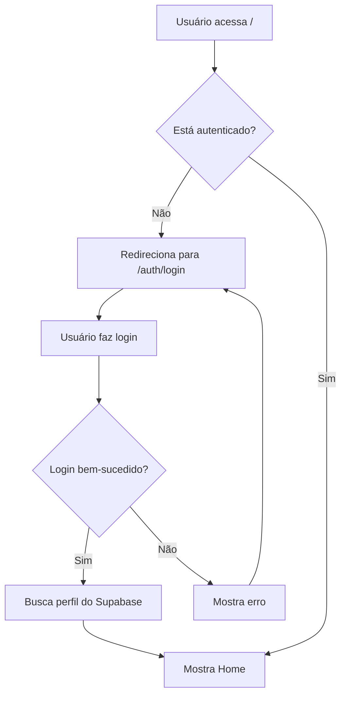

# 🔐 Configuração de Autenticação e Dados do Trivoo

## 📋 O que foi implementado

### ✅ Sistema de Autenticação Completo
- ✅ Página de Login (`/auth/login`)
- ✅ Página de Cadastro (`/auth/signup`)
- ✅ Hook `useAuth` integrado com Supabase
- ✅ Proteção de rotas (requer login)
- ✅ Modal de Logout
- ✅ Perfil de usuário no banco de dados

### ✅ Dados Reais do Supabase
- ✅ Clubes, Professores e Eventos salvos no banco
- ✅ Dados do perfil do usuário autenticado
- ✅ Esportes de interesse do usuário
- ✅ Script SQL para popular banco de dados

## 🚀 Como Configurar

### 1. Executar Scripts no Supabase

Acesse o [Supabase SQL Editor](https://app.supabase.com/project/ovhmuidvyqvwhmdondia/sql) e execute **NA ORDEM**:

```sql
-- 1️⃣ Schema principal (se ainda não executado)
supabase/schema.sql

-- 2️⃣ Configuração de esportes (se ainda não executado)
supabase/sports_setup.sql

-- 3️⃣ Popular dados dos JSONs
supabase/populate_data.sql
```

### 2. Testar Autenticação

#### Criar um usuário de teste:

1. Acesse: `http://localhost:3000/auth/signup`
2. Preencha os dados:
   - **Nome:** João Silva
   - **Email:** joao@teste.com
   - **Telefone:** (21) 99999-9999
   - **Senha:** Teste@123
3. Clique em "Criar conta"

#### Fazer Login:

1. Será redirecionado para `/auth/login`
2. Entre com:
   - **Email:** joao@teste.com
   - **Senha:** Teste@123
3. Você será redirecionado para a home autenticada

### 3. Adicionar Esportes de Interesse

1. Após fazer login, vá em **Meu Perfil**
2. Clique em **"Adicionar esportes"**
3. Selecione seus esportes favoritos
4. Clique em **"Salvar"**
5. Os esportes aparecerão na Home!

## 📊 Dados no Banco

### Clubes (7 registros)
- Centro Horizonte
- Boulder Lab
- KinBall & Floorball Hub
- Campo Verde Footgolf
- Biribol & Natação Adaptada São Francisco
- Tamboréu Praia Clube
- Hangar 101

### Professores (11 registros)
- Victor Nascimento (Tamboréu)
- Helena Moraes (Esgrima)
- Lucas Prado (Escalada)
- Ana Bechara (Corrida)
- Mateus Furlan (Natação)
- Clarice Neri (Beach Tennis)
- Rogério Saito (Cross Fit)
- Naomi Tanaka (Tênis de Mesa)
- Gabriel Mitter (Futebol)
- Yara Potiguara (Ginástica Rítmica)
- Bruno Dantas (Escalada)

### Eventos (10 registros)
- Trilha de Orientação Camboinhas
- Night Parkour Meetup
- Korfebol Aberto da Baía
- Circuito Inclusivo - Bocha na Praça
- Open de Esgrima — Iniciação & Amistoso
- Slackline Festival - Lagoa de Piratininga
- Patins Street Jam — Neves
- Clínica de Polo Aquático — Iniciantes
- Lacrosse Day — Amistoso Misto
- Footgolf Aberto da Restinga

### Esportes (23 registros)
Todos os esportes da plataforma disponíveis para seleção

## 🔄 Fluxo de Autenticação



## 🔐 Segurança

### Row Level Security (RLS) Ativo

Todas as tabelas têm políticas de segurança:

- ✅ **Profiles:** Usuários só editam próprio perfil
- ✅ **User_sports:** Usuários só gerenciam próprios esportes
- ✅ **Clubs/Teachers/Events:** Leitura pública
- ✅ **Storage:** Upload apenas do próprio avatar

## 🧪 Testar Sistema

### 1. Criar Conta
```bash
# Acesse
http://localhost:3000/auth/signup

# Preencha e crie conta
```

### 2. Fazer Login
```bash
# Acesse
http://localhost:3000/auth/login

# Entre com suas credenciais
```

### 3. Ver Dados
```bash
# Home - Ver clubes, professores e eventos
http://localhost:3000

# Perfil - Editar dados e adicionar esportes
http://localhost:3000/profile

# Swipe - Sistema de swipe para professores
http://localhost:3000/swipe
```

## 📝 Verificar no Supabase

### Tabela `profiles`
```sql
SELECT * FROM profiles;
```

### Esportes do usuário
```sql
SELECT 
  p.name,
  s.name as sport
FROM profiles p
JOIN user_sports us ON p.id = us.user_id
JOIN sports s ON us.sport_id = s.id;
```

### Todos os dados
```sql
SELECT COUNT(*) FROM clubs;     -- Deve retornar 7
SELECT COUNT(*) FROM teachers;  -- Deve retornar 11
SELECT COUNT(*) FROM events;    -- Deve retornar 10
SELECT COUNT(*) FROM sports;    -- Deve retornar 23
```

## 🐛 Troubleshooting

### Erro: "Invalid login credentials"
- Verifique email e senha
- Confirme que criou a conta primeiro

### Dados não aparecem
- Execute o script `populate_data.sql` no Supabase
- Verifique se as tabelas foram criadas corretamente

### Perfil não atualiza
- Limpe o cache do navegador
- Faça logout e login novamente
- Verifique se o RLS está configurado

## 🎉 Pronto!

Agora o Trivoo tem:
- ✅ Autenticação completa com Supabase
- ✅ Dados reais no banco de dados
- ✅ Perfis de usuário personalizáveis
- ✅ Esportes de interesse por usuário
- ✅ Sistema seguro com RLS

**Próximos passos:** Deploy no Vercel! 🚀

